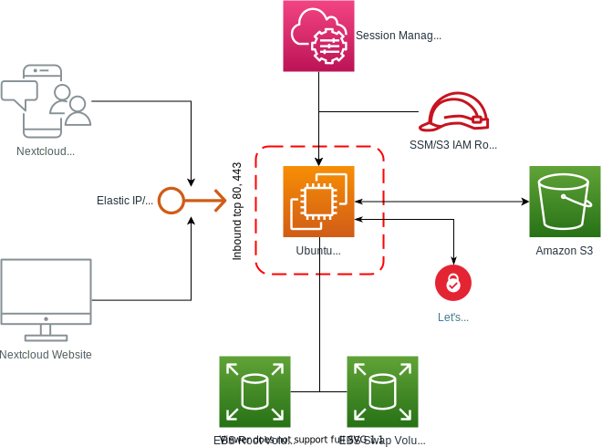

# Cloudformation Template: Nextcloud on AWS using EC2 and S3

This template deploys a Nexcloud instance on AWS.
The focus of the architecture is on cost-effectiveness and low maintenance/operational effort.

Core pillars are:

- Using S3 OneZone-IA as data storage for your files
- Using cheap EC2 instance types (e.g. t2.micro) and substituting missing RAM using a SWAP partition
- Using Ubuntu 20.04 LTS for long-term support (Ubuntu configuration includes automatic security patching)
- Using [Nextcloud Snap](https://github.com/nextcloud/nextcloud-snap) to leverage a maintained and automatic-updated bundle of Nextcloud (including Apache/PHP, Redis, Mysql)

For a small setup (50 GB storage), the costs are only around 3$/month:

- Storage: [0.5-1$](https://aws.amazon.com/de/s3/pricing/) for 50 GB S3 OneZone-IA
- Compute: [2-2.5$](https://www.ec2instances.info/) for the EC2 instance (type t3a, reserved/full upfront)

## Architecture

Notes:

- No SSH inbound is allowed by the security group (instead, a IAM role is attached to use SSM for terminal login).
- Even though HTTPS (port 443) is used for Nexcloud (auto-redirect port 80 -> 443), the let's encrypt certbot (which is activated in the snap/cloud-init) requires inbound port 80 for certificate renewal.
- The Nextcloud Plugin for accessing S3 ("external Storage") needs to be configured using AWS Access ID/KEY. Therefore, an IAM user is created and Access ID and KEY is shown in the Output section of the CloudFormation stack.
- The S3 bucket is created with an lifecycle policy to transition objects to OneZone-IA after 30 days.
- Data-at-rest-encryption: EBS volumes are encrypted using default encryption. For encrypting files on the S3 bucket there is currently no solution. S3 client-side encryption using Nextcloud's encryption capabilities are not working ([see Issue](https://github.com/nextcloud/server/issues/22077)). S3 Sever-side encryption is not possible as it requires the client (Nextcloud/plugin) to send [special headers](https://docs.aws.amazon.com/AmazonS3/latest/dev/UsingServerSideEncryption.html) which the plugin is not capable of.

## How to deploy

### Cloudformation Deployment

1. Go to the CloudFormation Web Console and deploy `aws-nextcloud-eip.cfn.yaml`. This will create an Elastic IPv4 Address. The IPv4 address will be shown in the outputs section of CloudFormation.
2. Go to your domain registrar and set the A record of your Nextcloud (sub) domain to the Elastic IPv4 address.
3. Go to the CloudFormation Web Console and deploy `aws-nextcloud-snap.cfn.yaml`. This will deploy the Nextcloud EC2 instance, Security Groups and an S3 bucket.

The Nexcloud instance will be fully installed and started using your provided username and password for the admin user.

### Configuring S3 as file backend

- On your Nextcloud webinterface, add two plugins rom the standard catalog: "External storage support" and "S3 Versioning"
- In the Nextcloud settings, go to the general configuration of the "external storage" plugin.
- Fill in the configuration for your S3 bucket by using the output section of the Cloudformation stack:
  - Bucket = your bucket name, e.g. \<your-stack-name\>-bucket
  - Host-Name = (leave empty)
  - Port = 443
  - Region = e.g. eu-central-1
  - Select SSL activation
  - The Key ID and Secret Access Key = (see CloudFormation's output section)
  
### Login to your EC2 instance

- At the AWS Console > EC2 Dashboard > \<select your Instance\> > Actions > Connect > Session Manager > Connect
- `sudo -i`
- Refer to [Nextcloud Snap](https://github.com/nextcloud/nextcloud-snap) for information on the command line options.
